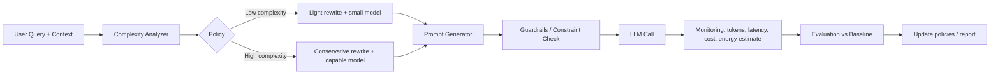

# Energy-Efficient LLM Usage

A prototype system that optimizes LLM token usage to reduce inference cost and estimated energy consumption. Human prompts are often verbose, redundant, or poorly structured, which leads to unnecessary tokens and higher compute cost. This project addresses that problem as part of a **Green Computing** course.

## Problem

LLM usage cost and energy footprint scale with tokens processed. In practice, many user prompts include:

- Redundant phrasing and filler text
- Missing structure that forces longer back-and-forth
- Oversized context (large pasted documents, irrelevant details)
- One-size-fits-all model selection for both simple and complex tasks

The goal is to **reduce tokens and compute without materially degrading output quality**.

## Architecture



### Pipeline Overview

```
1. User Query
       ↓
2. Query Complexity Analyzer
       ↓
3. Energy-Aware Prompt Optimizer
       ↓
4. Adaptive Prompt Generator
       ↓
5. LLM Call / Usage
       ↓
6. Performance Monitoring
       ↓
7. Evaluation Module
```

## Stage-by-Stage Design

| Stage | Role | Responsibility |
|-------|------|----------------|
| **1. User Query** | Entry point | Accept user input and metadata (task type, domain, latency budget, quality bar) |
| **2. Query Complexity Analyzer** | Routing / policy input | Estimate task difficulty and select an optimization policy |
| **3. Energy-Aware Prompt Optimizer** | Core optimization | Decide what to change: compress wording, trim context, choose model tier |
| **4. Adaptive Prompt Generator** | Prompt assembly | Build the final prompt (system + user + structured fields) |
| **5. LLM Call / Usage** | Execution | Send the optimized prompt to the model and collect the response |
| **6. Performance Monitoring** | Runtime telemetry | Log tokens, latency, cost, and energy estimates |
| **7. Evaluation Module** | Quality validation | Compare optimized vs. baseline on task success and savings |

### 1. User Query

The entry point for raw user input. In addition to the query text, capture metadata that informs downstream policy decisions:

- Task type (QA, summarization, coding, etc.)
- Domain constraints
- Latency and quality requirements

### 2. Query Complexity Analyzer

Estimates how difficult or sensitive a query is before applying optimization. This prevents aggressive compression on tasks that need precision.

**Example complexity signals:**

- Prompt length and ambiguity
- Reasoning depth required
- Need for tools or external retrieval
- Safety or compliance sensitivity

### 3. Energy-Aware Prompt Optimizer

The core value of the system. This stage decides *what* to optimize based on complexity and policy.

**Optimization levers:**

- Remove redundant phrasing
- Compress instructions while preserving intent
- Deduplicate or trim context
- Select a cheaper model when appropriate
- Reduce retries by improving prompt clarity

**Energy-aware proxies** (for a prototype):

- Total tokens (input + output)
- Estimated cost using provider pricing
- Estimated energy via a simple model: `energy ≈ f(tokens, model_size, hardware)`

### 4. Adaptive Prompt Generator

Assembles the final prompt sent to the LLM. Separated from the optimizer so each component can be tested and swapped independently.

**Implementation options:**

- Rule-based templates
- Meta-LLM prompt rewriter
- Hybrid (rules + LLM for hard cases)

### 5. LLM Call / Usage

Executes the optimized prompt against the selected model. Logs all usage data needed for monitoring and evaluation.

### 6. Performance Monitoring

Collects runtime metrics for every request:

- Input and output token counts
- Model used
- Latency
- Estimated cost
- Estimated energy consumption

### 7. Evaluation Module

Validates that optimization actually helps—and does not break task quality. Always compare against an **unoptimized baseline** on the same queries.

**Metrics:**

| Category | Examples |
|----------|----------|
| Efficiency | Token reduction, cost savings, energy estimate |
| Quality | Task success rate, format compliance, human/LLM rubric |
| Reliability | Constraint satisfaction, retry count, latency |

**Target outcome:**

> Reduce estimated inference energy by **X%** while keeping task success within **Y%** of baseline.

## Recommended Extensions

These strengthen the architecture without replacing it:

### Baseline Path (Control Group)

Always run evaluation against unoptimized prompts. Without a baseline, it is impossible to prove savings.

### Safety / Fidelity Guardrails

Aggressive compression can drop critical constraints. Add a pre-flight check before the LLM call:

- Preserve required output format (e.g., JSON only)
- Retain negations and safety rules (e.g., "do not include PII")
- Keep few-shot examples that stabilize output

### Context Management

Large pasted context is often the biggest token sink. Consider a dedicated step between complexity analysis and optimization:

- Retrieve only relevant chunks (RAG)
- Summarize long inputs before sending

### Model Routing

Token cost is not only about prompt length. Route easy queries to smaller/cheaper models and reserve capable models for complex tasks.

### Feedback Loop

Use evaluation results to refine policies in stages 2 and 3. Even manual policy updates are sufficient for a prototype.

## Implementation Roadmap

### MVP (Must-Have)

1. Collect queries and baseline token usage
2. Rule-based prompt optimizer (remove filler, compress instructions, dedupe context)
3. Complexity-based policies (easy vs. hard)
4. Evaluation on 30–100 benchmark prompts

### Stretch Goals

- Meta-LLM prompt rewriter
- RAG / context chunk selection
- Adaptive model routing
- Live dashboard for token, cost, and energy estimates

### Out of Scope for v1

- Fully autonomous self-learning optimizer with no human-readable policies
- Claiming exact joules without a documented measurement methodology

## Design Considerations

Be prepared to address these in the project report:

1. **Optimizer overhead** — If stages 3–4 use an LLM to rewrite prompts, include that cost in total token/energy accounting.
2. **Cost vs. carbon** — Cost correlates with compute, but carbon depends on grid, region, and time. State assumptions clearly.
3. **Evaluation bias** — If using an LLM as judge, document limitations.
4. **Generalization** — Test across multiple task types (e.g., QA, summarization, coding).

## Project Structure

```
energy_efficient_llm_usage/
├── README.md
├── src/                    # Source code (to be added)
│   ├── analyzer/           # Query complexity analyzer
│   ├── optimizer/          # Energy-aware prompt optimizer
│   ├── generator/          # Adaptive prompt generator
│   ├── monitoring/         # Performance monitoring
│   └── evaluation/         # Evaluation module
├── data/                   # Benchmark queries and results
└── docs/                   # Architecture notes and reports
```

## Status

Early planning / prototype stage. Module implementation pending.

## License

TBD
