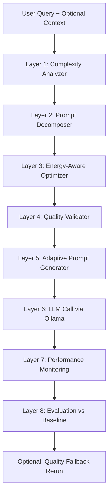

# Energy-Efficient LLM Usage

A prototype **Green Computing** system that reduces LLM inference cost and estimated energy consumption by analyzing user prompts, compressing them semantically, and adapting generation parameters — without materially degrading output quality on most task types.

This document is written to be **report- and paper-ready**: it explains how each layer works, what technology is used where and why, how to reproduce benchmark results, and what the evaluation data shows.

---

## Table of Contents

1. [Problem Statement](#problem-statement)
2. [Research Goal](#research-goal)
3. [System Architecture](#system-architecture)
4. [Layer-by-Layer Design](#layer-by-layer-design)
5. [Technology Choices](#technology-choices)
6. [Energy and Cost Accounting](#energy-and-cost-accounting)
7. [Benchmark Evaluation](#benchmark-evaluation)
8. [Setup and Execution](#setup-and-execution)
9. [Python API](#python-api)
10. [Testing](#testing)
11. [Project Structure](#project-structure)
12. [Known Limitations and Future Work](#known-limitations-and-future-work)
13. [Design Considerations for the Report](#design-considerations-for-the-report)

---

## Problem Statement

LLM usage cost and energy footprint scale with **tokens processed**. In practice, many user prompts are:

- **Verbose** — redundant phrasing, filler words, repeated instructions
- **Poorly structured** — missing format hints that force longer back-and-forth
- **Oversized** — large pasted context with irrelevant details
- **One-size-fits-all** — same model and token budget for both trivial and complex tasks

Sending these prompts directly to a capable model wastes compute. The goal of this project is to **reduce tokens and compute while preserving task success** through adaptive, complexity-aware optimization.

---

## Research Goal

> Reduce estimated inference energy by a significant margin while keeping task success within an acceptable range of an unoptimized baseline.

The system always compares against a **baseline path** (raw user query sent directly to the LLM with no optimization) so savings are measurable and defensible in a research report.

**Target proxies used in this prototype:**

| Proxy | Why it matters |
|-------|----------------|
| Input + output tokens | Direct driver of provider cost and GPU time |
| Latency (ms) | User experience and wall-clock compute |
| Energy proxy (token × model factor) | Comparable across runs without hardware sensors |
| Measured joules (optional, Windows) | Calibrated CPU-power integration during inference |

---

## System Architecture

### High-Level Flow



### End-to-End Pipeline (numbered stages)

```
1. User Query (+ optional context)
       ↓
2. Query Complexity Analyzer        → task type, complexity level, optimization policy
       ↓
3. Prompt Decomposer                  → structured intent, entities, constraints
       ↓
4. Energy-Aware Prompt Optimizer      → semantic + rule-based compression
       ↓
5. Quality Validator                  → embedding similarity + lexical guardrails
       ↓
6. Adaptive Prompt Generator          → system/user messages, inference params
       ↓
7. LLM Call (Ollama)                  → final response with token usage
       ↓
8. Performance Monitoring             → tokens, latency, energy estimates
       ↓
9. Evaluation Module                  → optimized vs baseline comparison
```

**Orchestration:** `src/pipeline.py` (`PromptPipeline`) wires all stages. The primary CLI entry point is `src/pipeline_cli.py`.

---

## Layer-by-Layer Design

Each layer has a single responsibility, can be tested independently, and feeds structured output to the next stage.

---

### Layer 1 — Query Complexity Analyzer

**Location:** `src/analyzer/`  
**Entry point:** `ComplexityAnalyzer.analyze(query, context)`

#### What it does

Before any optimization, the analyzer estimates how difficult and sensitive a query is. This prevents aggressive compression on tasks that need precision (coding, reasoning, safety-sensitive domains).

#### How it works (two sub-stages)

1. **Signal extraction** (`src/analyzer/signals.py`)  
   Rule-based feature extraction from the raw prompt:
   - Word/sentence/question counts
   - Reasoning, constraint, safety, multi-part, ambiguity, retrieval scores
   - Filler and verbosity scores (detects "could you please…", "in order to…")
   - Context size and context-to-query ratio

2. **Intent classification** (`src/analyzer/intent_classifier.py`)  
   Classifies the task type using either:
   - **Ollama** (`qwen2.5:0.5b`) — JSON output with `task_type`, `confidence`, `rationale`
   - **Heuristic fallback** — regex pattern matching when Ollama is unavailable

3. **Complexity scoring** (`src/analyzer/classifier.py`)  
   Combines task-type weight, signal scores, and context size into a 0–100 score, then maps to a level and policy.

#### Output

| Field | Example values | Used by |
|-------|----------------|---------|
| `level` | `low`, `medium`, `high`, `critical` | Generator, policy matrix |
| `task_type` | `definition`, `coding`, `reasoning`, `educational`, … | Templates, model tier |
| `policy` | `aggressive`, `moderate`, `conservative`, `minimal` | Optimizer |
| `score` | 12.18 (low) … 80+ (critical) | Rationale, confidence |
| `signals` | reasoning_score, safety_score, … | System prompt guardrails |
| `confidence` | 0.55–0.95 | Reporting |

#### Complexity levels and default policies

| Level | Meaning | Default policy | Typical tasks |
|-------|---------|----------------|---------------|
| `low` | Short, direct requests | `aggressive` | Definitions, simple facts |
| `medium` | Multi-step or moderate reasoning | `moderate` | Comparisons, coding |
| `high` | Deep reasoning, heavy context | `conservative` | Proofs, long analysis |
| `critical` | Safety-sensitive domains | `minimal` | Medical, legal, financial |

**Safety override:** If `safety_score ≥ 0.35`, level is forced to `critical` and policy to `minimal` regardless of score.

**Why this layer exists:** Optimization without routing is dangerous. A math proof and a "what is TCP?" question need different compression and inference budgets.

---

### Layer 2 — Prompt Decomposer

**Location:** `src/decomposer/`  
**Model:** `qwen2.5:0.5b` (Ollama) or heuristic fallback

#### What it does

Breaks the user prompt into a structured representation that the semantic optimizer can use to preserve intent while removing redundancy.

#### Output structure (`DecomposedPrompt`)

```json
{
  "intent": "explain",
  "core_request": "TCP three-way handshake",
  "entities": ["TCP"],
  "constraints": ["3-4 sentences"],
  "redundant_segments": ["could you please"],
  "context_summary": "...",
  "requires_context": false,
  "source": "ollama"
}
```

#### Why this layer exists

Raw text compression risks dropping constraints. By extracting `core_request`, `entities`, and `constraints` first, the optimizer knows what must survive compression.

---

### Layer 3 — Energy-Aware Prompt Optimizer

**Location:** `src/optimizer/`  
**Primary class:** `PromptOptimizer`  
**Semantic engine:** `LLMPromptOptimizer` (`qwen2.5:0.5b`)

#### What it does

Decides **what to change** in the prompt based on the analyzer policy, then applies compression.

#### Optimization levers

| Lever | Mechanism | When applied |
|-------|-----------|--------------|
| Semantic compression | Small LLM rewrites prompt | All policies except `minimal` |
| Filler removal | Regex rules (`src/optimizer/phrases.py`) | `aggressive`, `moderate` |
| Redundancy compression | Phrase deduplication | `aggressive` |
| Context deduplication | Line-level dedupe | `aggressive`, `conservative` |
| Context trimming | Word cap (120 words) | `aggressive` |
| Whitespace normalization | Always | All policies |

#### Policy behavior

| Policy | Behavior |
|--------|----------|
| `aggressive` | LLM rewrite + filler removal + context trim |
| `moderate` | LLM rewrite + common filler prefixes |
| `conservative` | LLM rewrite + whitespace + context dedupe only |
| `minimal` | No changes (safety-sensitive prompts) |

#### Fallback chain

```
LLM semantic rewrite
  → if Ollama unavailable OR policy is aggressive (offline mode)
      → rule-based optimizer
  → if policy is minimal
      → skip entirely
```

**Why this layer exists:** This is the core energy-saving mechanism. Shorter prompts and trimmed context directly reduce input tokens; combined with adaptive `max_tokens`, output tokens drop as well.

---

### Layer 4 — Quality Validator

**Location:** `src/validator/`  
**Model:** `nomic-embed-text` (embeddings)

#### What it does

Rejects semantic compression that changes meaning. Acts as a **pre-flight guardrail** before the LLM call.

#### Validation pipeline

1. **Lexical guardrail** (`src/optimizer/guardrails.py`) — checks that substantive content words are preserved
2. **Embedding similarity** — cosine similarity between original and candidate embeddings
3. **Threshold:** default `0.90` (configurable via `config/ollama.json` or `OLLAMA_VALIDATION_SIMILARITY_THRESHOLD`)

If validation fails → **original prompt is kept** and a note is recorded.

#### Why this layer exists

Aggressive compression can silently drop negations, format constraints, or safety rules. The validator ensures the optimizer's savings do not come at the cost of intent drift.

---

### Layer 5 — Adaptive Prompt Generator

**Location:** `src/generator/`  
**Policy matrix:** `src/generator/policy_matrix.py`

#### What it does

Assembles the final LLM-ready prompt and selects inference parameters based on complexity and task type.

#### Components produced

| Output | Description |
|--------|-------------|
| `system_prompt` | Task instruction + policy style + safety/constraint appendices |
| `user_prompt` | Optimized query (with optional context block) |
| `messages` | `[{role: system}, {role: user}]` for Ollama chat API |
| `template_id` | e.g. `definition_aggressive`, `coding_moderate` |
| `model_tier` | `small`, `medium`, or `large` (logical tier, not a separate model) |
| `inference_params` | `max_tokens`, `temperature`, `top_p` |

#### Policy matrix (complexity → inference action)

| Complexity | Model tier | max_tokens | temperature | Compression |
|------------|------------|------------|-------------|-------------|
| `low` | small | 256 | 0.1 | aggressive |
| `medium` | medium | 512 | 0.15 | moderate |
| `high` | large | 1024 | 0.15 | minimal |
| `critical` | large | 768 | 0.2 | none |

**Task overrides:**
- **Coding** → always `large` tier, `max_tokens=1024`
- **Simple definitions/facts at low complexity** → `small` tier, tight budget

#### System prompt assembly

Built from:
- Task-type instruction (e.g. "Give a concise definition…")
- Policy style (e.g. "Be concise.")
- Level guidance (e.g. "Work step by step when multi-part.")
- Conditional appendices for safety, constraints, retrieval, verbosity

**Why this layer exists:** Separating generation from optimization allows independent testing and swapping of templates. Adaptive `max_tokens` and temperature reduce output length for simple tasks without touching the model weights.

---

### Layer 6 — LLM Call (Ollama)

**Location:** `src/llm/`  
**Client:** `OllamaClient`  
**Default inference model:** `qwen3.5:4b`

#### What it does

Executes the generated messages against a local Ollama server and records usage metadata.

#### Two call paths

| Path | Method | Description |
|------|--------|-------------|
| **Optimized** | `client.call(generated)` | System + user messages with adaptive params |
| **Baseline** | `client.call_baseline(query, context)` | Raw user query only, no system prompt |

#### Recorded metrics per call

- `prompt_tokens`, `completion_tokens`, `total_tokens`
- `latency_ms`, `load_duration_ms`, `eval_duration_ms`
- `energy_proxy` — token-based estimate (not measured joules)
- `energy_measured_j` — optional calibrated joules via `EnergyMonitor`
- `thinking` — Qwen extended reasoning mode (auto-enabled for high/critical complexity)

**Why Ollama only:** Keeps the prototype fully local, reproducible, and free of API keys. All auxiliary models (analyzer, optimizer, embeddings) also run through the same Ollama instance.

---

### Layer 7 — Performance Monitoring

**Location:** `src/monitoring/`

#### What it does

Collects per-request telemetry for both optimized and baseline paths into a `MonitoringSnapshot`.

#### Metrics collected

| Metric | Optimized path | Baseline path |
|--------|----------------|---------------|
| Prompt words | After optimization | Raw query words |
| Token counts | From Ollama response | From Ollama response |
| Latency (ms) | Yes | Yes |
| Energy proxy | Yes | Yes |
| Measured joules | Yes (if psutil available) | Yes |
| Model / tier | Yes | Model only |

#### Energy measurement (Windows)

`src/monitoring/energy.py` integrates estimated CPU power during inference:

```
joules = (base_power_watts + cpu_watts_per_percent × avg_cpu%) × duration_seconds
```

Default Windows calibration: `base=8.0W`, `cpu_factor=0.35W/%`. Requires `psutil` (listed in `requirements-dev.txt`).

**Why this layer exists:** Every request is logged for evaluation and reporting. Without monitoring, energy claims are not auditable.

---

### Layer 8 — Evaluation Module

**Location:** `src/evaluation/`

#### What it does

Compares the optimized pipeline against the unoptimized baseline on efficiency and quality.

#### Efficiency metrics

- Word reduction percent (offline, always available)
- Prompt token reduction percent (requires `--call`)
- Total token reduction percent (requires `--call`)
- Energy savings percent (requires `--call`)
- Latency delta (optimized − baseline)

#### Quality gate

When both paths include live LLM completions (`--call --evaluate`):
- Normalized string comparison of baseline vs optimized completion
- `passed_quality_gate = false` if completions differ (manual review recommended)

#### Optional quality fallback

With `--fallback`, if the optimized output is too short or low quality, the pipeline reruns with a **relaxed policy** (more conservative compression, higher `max_tokens`). See `src/pipeline_fallback.py`.

**Why this layer exists:** Proves the system helps. Without a baseline control group, token savings cannot be attributed to the optimizer.

---

## Technology Choices

| Component | Technology | Model / Tool | Why |
|-----------|------------|--------------|-----|
| Intent classification | Ollama chat | `qwen2.5:0.5b` | Fast, low-cost JSON classification |
| Prompt decomposition | Ollama chat | `qwen2.5:0.5b` | Structured extraction without large model cost |
| Semantic optimization | Ollama chat | `qwen2.5:0.5b` | Rewrites prompts cheaply; overhead is small vs main call |
| Quality validation | Ollama embed | `nomic-embed-text` | Semantic similarity without an LLM judge |
| Final inference | Ollama chat | `qwen3.5:4b` | Balanced quality/speed for local hardware |
| Rule-based fallback | Python regex | — | Works offline; no Ollama required for tests |
| Energy measurement | psutil + calibration | — | Approximates joules without dedicated power meters |
| Test framework | pytest | — | 37+ offline tests, 1 optional integration test |

### Configuration precedence

Settings load in this order (later wins):

1. Defaults in `src/llm/config.py`
2. `config/ollama.json`
3. Environment variables (`OLLAMA_MODEL`, `OLLAMA_BASE_URL`, etc.)

See [`INSTRUCTION_OLLAMA.md`](INSTRUCTION_OLLAMA.md) for full Ollama setup.

---

## Energy and Cost Accounting

When reporting results in a paper, account for **all** Ollama calls in the optimized path:

| Stage | Calls per request | Count toward overhead? |
|-------|-------------------|------------------------|
| Intent classifier | 1 × `qwen2.5:0.5b` | Yes |
| Decomposer | 1 × `qwen2.5:0.5b` | Yes |
| Semantic optimizer | 1 × `qwen2.5:0.5b` | Yes |
| Embedding validator | 2 × `nomic-embed-text` | Yes (if rewrite attempted) |
| Final inference | 1 × `qwen3.5:4b` | Yes |

**Net savings** = baseline inference cost − (optimized inference + optimizer overhead).

In practice, the benchmark shows large savings on the main inference call because `max_tokens` and prompt length drop dramatically for simple tasks. Optimizer overhead is small relative to a 2,500-token baseline completion.

**Two energy numbers appear in CLI output:**

| Field | Meaning |
|-------|---------|
| `energy_proxy` | `total_tokens × model_factor` — comparable across runs |
| `energy_measured_j` | Calibrated joules from CPU sampling during inference |

State clearly in the report that `energy_proxy` is a **proxy**, not measured wall-power from the GPU.

---

## Benchmark Evaluation

This section summarizes the four live benchmark runs documented in [`Benchmark.md`](Benchmark.md) and [`benchmark.txt`](benchmark.txt). All runs used **Ollama** with model `qwen3.5:4b` on Windows.

### How to reproduce

```bash
# 1. Baseline (raw query, no optimization)
python -m src.baseline_cli "YOUR QUERY HERE" --call

# 2. Optimized (full pipeline + LLM call)
python -m src.pipeline_cli "YOUR QUERY HERE" --call

# 3. Side-by-side comparison in one command
python -m src.pipeline_cli "YOUR QUERY HERE" --call --evaluate --json
```

### Overall verdict

| Category | Verdict |
|----------|---------|
| Query Classification | Good |
| Prompt Compression | Moderate |
| Adaptive Inference | Very Good |
| Energy Reduction | Excellent |
| Latency Reduction | Excellent |
| Quality Preservation | Good |
| Reasoning Tasks | Needs Improvement |
| Coding Tasks | Very Good |

**Overall score: 8.7 / 10**

The framework reduces energy, latency, and token usage while maintaining acceptable quality on most tasks.

---

### Benchmark 1 — TCP Three-Way Handshake (Definition)

**Query:**
```text
What is TCP three-way handshake? Explain in 3-4 sentences with a simple example.
```

| Metric | Baseline | Optimized | Improvement |
|--------|----------|-----------|-------------|
| Latency | 9,020 ms | 3,908 ms | **56.7% ↓** |
| Tokens | 187 | 161 | **13.9% ↓** |
| Energy proxy | 0.1496 | 0.1288 | **13.9% ↓** |

**Pipeline routing:** `definition` / `low` / `aggressive` / template `definition_aggressive` / `max_tokens=256`

**Quality:** Both answers correctly explained the handshake. Optimized response was more concise; baseline included an extra dinner analogy.

**Prompt compression:** 13 → 10 words (23.1% reduction). Embedding similarity = 0.988 (passed validation).

**Result: PASS**

---

### Benchmark 2 — Operating Systems Study Notes (Summarization)

**Query:**
```text
I have an Operating Systems exam tomorrow. Summarize the concepts of Process, Thread, Context Switching, and Deadlock into concise study notes.
```

| Metric | Baseline | Optimized | Improvement |
|--------|----------|-----------|-------------|
| Latency | 14,880 ms | 5,907 ms | **60.3% ↓** |
| Tokens | 982 | 317 | **67.7% ↓** |
| Energy proxy | 0.7856 | 0.2536 | **67.7% ↓** |

**Pipeline routing:** `educational` / `low` / `aggressive` / template `educational_aggressive` / `max_tokens=256`

**Quality:** Baseline produced very long notes with tables and repetition. Optimized produced focused exam-ready notes covering all four topics.

**Prompt compression:** 21 → 20 words (4.8% reduction). Embedding similarity = 0.932 (passed).

**Result: PASS**

---

### Benchmark 3 — Project Assignment Problem (Reasoning) — FAILURE

**Query:**
```text
A company has 5 projects and 4 employees. Each project requires at least one employee, and each employee can work on multiple projects. Calculate the number of possible project assignments and explain your reasoning step by step.
```

| Metric | Baseline | Optimized | Improvement |
|--------|----------|-----------|-------------|
| Latency | 15,206 ms | 5,921 ms | **61.1% ↓** |
| Tokens | 1,034 | 332 | **67.9% ↓** |
| Energy proxy | 0.8272 | 0.2656 | **67.9% ↓** |

**Pipeline routing (incorrect):** `educational` / `low` / `aggressive` / `max_tokens=256`

**Quality:** Baseline correctly derived $(2^4 - 1)^5 = 15^5 = 759{,}375$. Optimized reframed the problem as "distinct balls into distinct bins" (wrong combinatorial model) and produced an incomplete answer.

**Root cause:** Complexity analyzer misclassified a mathematical reasoning task as `educational` / `low` / `aggressive`. It should have been `reasoning` / `high` / `conservative` with `max_tokens=512–1024`.

**Result: FAIL** — good efficiency, bad reasoning preservation.

---

### Benchmark 4 — Dijkstra Coding Task

**Query:**
```text
Write a Python program that implements Dijkstra's shortest path algorithm using a priority queue. Explain the time complexity and provide sample input and output.
```

| Metric | Baseline | Optimized | Improvement |
|--------|----------|-----------|-------------|
| Latency | 35,624 ms | 10,265 ms | **71.2% ↓** |
| Tokens | 2,586 | 636 | **75.4% ↓** |
| Energy proxy | 2.0688 | 0.5088 | **75.4% ↓** |

**Pipeline routing:** `coding` / `medium` / `moderate` / template `coding_moderate` / `max_tokens=1024`

**Quality:** Baseline produced broken, hallucinated code with contradictory fixes. Optimized produced a clean, runnable `heapq`-based implementation with sample I/O.

**Result: PASS** — optimized answer was actually *better* than baseline.

---

### Aggregate Benchmark Metrics

| Metric | Baseline Avg | Optimized Avg | Improvement |
|--------|--------------|---------------|-------------|
| Latency | 18.68 s | 6.50 s | **65.2% ↓** |
| Tokens | 1,197 | 362 | **69.8% ↓** |
| Energy proxy | 0.9578 | 0.2892 | **69.8% ↓** |

**Quality preserved on 3 out of 4 benchmark categories.**

### Benchmark strengths and weaknesses

**Works very well for:**
- Definitions and simple explanations
- Study notes and summarization
- Coding tasks (adaptive `max_tokens` and coding template help significantly)

**Primary weakness:**
- Mathematical / combinatorial reasoning tasks misclassified as `educational` / `low` / `aggressive`

**Recommended fix (highest priority):** Add a reasoning detector triggered by phrases like `calculate`, `prove`, `derive`, `how many`, `combinatorics`, `step by step`. When detected → `task_type=reasoning`, `policy=conservative`, `max_tokens=512–1024`, `temperature=0.1`.

### Offline labeled benchmark suite

In addition to the four live LLM benchmarks above, the repo includes **23 labeled offline cases** in `data/benchmark_prompts.json` that validate routing and prompt assembly without calling Ollama:

```bash
python -m src.benchmark_cli --verbose
```

---

## Setup and Execution

### Prerequisites

| Requirement | Notes |
|-------------|-------|
| Python 3.10+ | Tested on Windows with Python 3.14 |
| `pip install -r requirements-dev.txt` | pytest, psutil |
| Ollama (for `--call`) | Local LLM server at `http://localhost:11434` |

### Installation

```bash
# From repository root
python -m venv .venv

# Windows
.venv\Scripts\activate

# macOS / Linux
source .venv/bin/activate

pip install -r requirements-dev.txt

# Optional: install CLI entry points
pip install -e .
```

Always run commands from the **repository root** so `config/ollama.json` and `data/` paths resolve correctly.

### Ollama setup (required for live benchmarks)

```bash
# Install Ollama from https://ollama.com, then pull models:
ollama pull qwen3.5:4b        # Final inference
ollama pull qwen2.5:0.5b      # Analyzer, decomposer, optimizer
ollama pull nomic-embed-text  # Embedding validation

# Verify
ollama list
curl http://localhost:11434/api/tags
```

Full details: [`INSTRUCTION_OLLAMA.md`](INSTRUCTION_OLLAMA.md)

### Command reference

| Goal | Command |
|------|---------|
| Full pipeline (offline) | `python -m src.pipeline_cli "YOUR QUERY" --json` |
| Full pipeline + LLM call | `python -m src.pipeline_cli "YOUR QUERY" --call` |
| Pipeline + baseline comparison | `python -m src.pipeline_cli "YOUR QUERY" --call --evaluate --json` |
| Baseline only (unoptimized) | `python -m src.baseline_cli "YOUR QUERY" --call` |
| Analyzer only | `python -m src.analyzer.cli "YOUR QUERY" --json` |
| Offline benchmark suite | `python -m src.benchmark_cli --verbose` |
| All unit tests | `python -m pytest` |
| Integration test (live Ollama) | `python -m pytest -m integration` |

### Common flags (`pipeline_cli`)

| Flag | Purpose |
|------|---------|
| `--context`, `-c` | Inline context or path to context file |
| `--file`, `-f` | Read query from a text file |
| `--json` | Machine-readable `PipelineResult` |
| `--call` | Send to Ollama and record tokens |
| `--evaluate` | Compare vs baseline (runs baseline LLM with `--call`) |
| `--model` | Override inference model |
| `--think true\|false\|auto` | Qwen thinking mode |
| `--fallback` | Rerun with relaxed policy if quality is low |

### Example: reproduce TCP benchmark

```bash
python -m src.baseline_cli "What is TCP three-way handshake? Explain in 3-4 sentences with a simple example." --call

python -m src.pipeline_cli "What is TCP three-way handshake? Explain in 3-4 sentences with a simple example." --call
```

### Example: query with external context

```bash
python -m src.pipeline_cli --file my_prompt.txt --context data/context/meeting_notes.txt --call --evaluate --json
```

### Installed entry points (after `pip install -e .`)

```bash
optimize-prompt "What is 2 + 2?" --json
analyze-complexity "What is the capital of France?" --json
call-baseline "What is 2 + 2?" --json
run-benchmark --verbose
```

More CLI detail: [`EXECUTION.md`](EXECUTION.md) and [`src/README.md`](src/README.md).

---

## Python API

### End-to-end pipeline (offline)

```python
from src.pipeline import PromptPipeline

result = PromptPipeline(use_ollama=True).process(
    "Could you please explain in order to understand photosynthesis.",
)

print(result.analysis.policy)               # aggressive / moderate / conservative / minimal
print(result.analysis.task_type)            # definition, coding, reasoning, ...
print(result.optimization.optimized_query)  # compressed user text
print(result.generation.model_tier)         # small / medium / large
print(result.generation.inference_params)   # max_tokens, temperature, top_p
print(result.generation.messages)           # [{role, content}, ...]
print(result.to_dict())
```

### With live Ollama call and evaluation

```python
from src.llm import OllamaClient
from src.pipeline import PromptPipeline

pipeline = PromptPipeline(llm_client=OllamaClient(), use_ollama=True)
result = pipeline.process(
    "What is TCP three-way handshake? Explain in 3-4 sentences.",
    call_llm=True,
    evaluate=True,
)

print(result.completion)
print(result.llm.usage.total_tokens)
print(result.evaluation.efficiency.total_token_reduction_percent)
print(result.evaluation.baseline_completion)
print(result.monitoring.to_dict())
```

### Individual stages

```python
from src.analyzer import ComplexityAnalyzer
from src.optimizer import PromptOptimizer
from src.generator import AdaptivePromptGenerator
from src.decomposer import PromptDecomposer

analysis = ComplexityAnalyzer(use_ollama=True).analyze("What is the capital of France?")
decomposed = PromptDecomposer(use_ollama=True).decompose("What is the capital of France?", None, analysis)
optimization = PromptOptimizer(use_ollama=True).optimize("Could you please ...", None, analysis, decomposed)
generation = AdaptivePromptGenerator().generate(analysis, optimization, decomposed)
```

---

## Testing

```bash
# All tests (fast, no Ollama required except one optional integration test)
python -m pytest

# Skip live Ollama integration test
python -m pytest -m "not integration"

# By area
python -m pytest tests/test_complexity_analyzer.py -q
python -m pytest tests/test_optimizer.py -q
python -m pytest tests/test_generator.py -q
python -m pytest tests/test_benchmark_prompts.py -q
python -m pytest tests/test_llm.py -q
python -m pytest tests/test_monitoring_evaluation.py -q
```

| Test file | Validates |
|-----------|-----------|
| `test_complexity_analyzer.py` | Level/policy routing, safety overrides, signal extraction |
| `test_optimizer.py` | Filler removal, context trim, minimal policy, pipeline wiring |
| `test_generator.py` | Model tier, system/user assembly, guardrail appendices |
| `test_benchmark_prompts.py` | 23 labeled offline cases end-to-end |
| `test_llm.py` | Config loading, mocked Ollama, optional live call |
| `test_monitoring_evaluation.py` | Monitoring snapshots, baseline comparison |
| `test_semantic_pipeline.py` | Ollama-backed semantic optimization path |
| `test_quality_improvements.py` | Validator and fallback behavior |

---

## Project Structure

```
energy_efficient_llm_usage/
├── README.md                      # This document
├── EXECUTION.md                   # Detailed run guide
├── INSTRUCTION_OLLAMA.md          # Ollama model setup
├── Benchmark.md                   # Benchmark analysis and verdicts
├── benchmark.txt                  # Raw CLI output from benchmark runs
├── pyproject.toml                 # Package metadata and CLI entry points
├── requirements-dev.txt           # pytest, psutil
├── config/
│   └── ollama.json                # Default Ollama settings
├── data/
│   ├── benchmark_prompts.json     # 23 labeled offline benchmark cases
│   ├── query_type_benchmark.json  # Query-type classification cases
│   └── context/                   # Sample context files for tests
├── src/
│   ├── pipeline.py                # Orchestrates all layers
│   ├── pipeline_cli.py            # Main CLI entry point
│   ├── pipeline_fallback.py       # Quality fallback rerun
│   ├── baseline.py / baseline_cli.py   # Unoptimized LLM path
│   ├── benchmark.py / benchmark_cli.py # Offline labeled benchmark
│   ├── compare_cli.py             # Output comparison utility
│   ├── constraints.py             # Constraint extraction helpers
│   ├── text_utils.py              # Shared text utilities
│   ├── analyzer/                  # Layer 1: complexity + intent
│   ├── decomposer/                # Layer 2: structured decomposition
│   ├── optimizer/                 # Layer 3: semantic + rule compression
│   ├── validator/                 # Layer 4: embedding validation
│   ├── generator/                 # Layer 5: prompt assembly + policy matrix
│   ├── llm/                       # Layer 6: Ollama client + config
│   ├── monitoring/                # Layer 7: telemetry + energy measurement
│   └── evaluation/                # Layer 8: baseline comparison
└── tests/                         # pytest suite
```

---

## Known Limitations and Future Work

| Limitation | Impact | Planned fix |
|------------|--------|-------------|
| Reasoning tasks misclassified as `educational` / `low` | Wrong policy → truncated math answers | Reasoning detector with keyword triggers |
| Optimizer overhead not always reported separately | Total energy accounting incomplete | Log per-stage token counts |
| `energy_proxy` is not measured GPU joules | Cannot claim exact wall-power savings | Report both proxy and calibrated joules; state assumptions |
| Single inference model (`qwen3.5:4b`) | No true multi-model routing yet | Route easy queries to smaller models |
| Quality gate uses normalized string match | Misses semantic equivalence | LLM-as-judge or embedding similarity on completions |
| No RAG / context chunk selection | Large pasted context still costly | Retrieve or summarize relevant chunks only |

**Highest-priority improvement:** Reasoning-aware task detection before broader evaluation.

---

## Design Considerations for the Report

When writing the project report or paper, address these points explicitly:

1. **Optimizer overhead** — Stages 1–4 each call a small Ollama model. Include their token cost when claiming net energy savings.

2. **Cost vs. carbon** — Token cost correlates with compute, but carbon depends on grid mix, region, and time of day. State assumptions clearly.

3. **Evaluation bias** — The quality gate uses normalized string comparison, not human or LLM rubrics. Document this limitation.

4. **Generalization** — Benchmark covers definition, summarization, reasoning, and coding. Report per-category results, not just averages.

5. **Failure analysis** — The reasoning benchmark failure is informative: efficiency gains are meaningless if task success drops. Use it to motivate the reasoning detector fix.

6. **Baseline fairness** — The baseline path sends the raw query with no system prompt. The optimized path adds a system prompt (extra prompt tokens) but saves far more on completion tokens via `max_tokens` and concise templates.

### Suggested report structure

1. Introduction and Green Computing motivation
2. Related work (prompt compression, model routing, energy proxies)
3. System architecture (use the layer diagram above)
4. Methodology (complexity scoring, semantic optimization, validation)
5. Experimental setup (Ollama models, hardware, benchmark queries)
6. Results (aggregate table + per-category analysis from [Benchmark Evaluation](#benchmark-evaluation))
7. Discussion (strengths, reasoning failure, overhead accounting)
8. Conclusion and future work

---

## Implementation Status

| Component | Status |
|-----------|--------|
| Query complexity analyzer | Done |
| Intent classifier (Ollama + heuristic) | Done |
| Prompt decomposer | Done |
| Energy-aware prompt optimizer (LLM + rules) | Done |
| Quality validator (embeddings + guardrails) | Done |
| Adaptive prompt generator + policy matrix | Done |
| Pipeline orchestration | Done |
| Ollama LLM wrapper | Done |
| Performance monitoring + energy measurement | Done |
| Evaluation module | Done |
| Baseline LLM CLI | Done |
| Offline + live benchmark suite | Done |
| Quality fallback rerun | Done |
| Reasoning-aware routing fix | Planned |

---

## License

TBD
