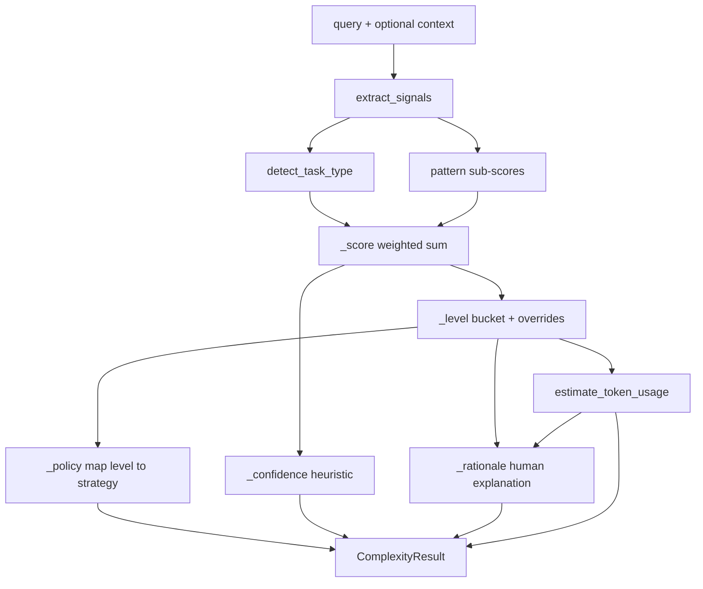

# Query Complexity Analyzer

Stage 2 of the energy-efficient LLM usage pipeline. This module classifies a user prompt **before** any optimization happens, so downstream stages know how aggressively they can compress the prompt without breaking task quality.

This is a **heuristic, rule-based classifier**. It does not call an LLM. It uses keyword patterns, length features, and weighted scoring to produce a structured result.

## Role in the pipeline

```
User Query (+ optional context)
        ↓
Query Complexity Analyzer   ← this module
        ↓
Energy-Aware Prompt Optimizer (uses policy + level)
        ↓
Adaptive Prompt Generator
        ↓
LLM Call
```

The analyzer answers one question:

> How risky would it be to aggressively shorten or rewrite this prompt?

## Output fields

Each call to `ComplexityAnalyzer.analyze()` returns a `ComplexityResult` with:

| Field | Type | Meaning |
|-------|------|---------|
| `level` | `low` / `medium` / `high` / `critical` | Complexity bucket for routing |
| `score` | `0.0 – 100.0` | Numeric complexity estimate |
| `task_type` | e.g. `factual`, `coding`, `reasoning` | Detected intent category |
| `policy` | `aggressive` / `moderate` / `conservative` / `minimal` | Recommended optimization strength |
| `confidence` | `0.0 – 0.95` | Heuristic certainty of the classification |
| `estimated_input_tokens` | int | Estimated prompt tokens sent to the model |
| `estimated_output_tokens` | int | Estimated completion tokens returned by the model |
| `estimated_total_tokens` | int | Estimated overall usage (`input + output`) |
| `signals` | dict | Raw feature values used internally |
| `rationale` | list[str] | Human-readable explanation lines |

Example:

```python
from src.analyzer import ComplexityAnalyzer

result = ComplexityAnalyzer().analyze("What is the capital of France?")
print(result.level)                    # ComplexityLevel.LOW
print(result.score)                      # ~0.28
print(result.task_type)                # TaskType.FACTUAL
print(result.policy)                   # OptimizationPolicy.AGGRESSIVE
print(result.confidence)               # ~0.79
print(result.estimated_total_tokens)   # ~41 (7 input + 34 output)
```

## Module layout

```
src/analyzer/
├── README.md         # This document
├── models.py         # Enums and ComplexityResult dataclass
├── signals.py        # Feature extraction from prompt text
├── token_estimate.py # Input/output/total token estimation
├── classifier.py     # Scoring, level/policy mapping, confidence
└── cli.py            # Command-line interface
```

## Behind the scenes: end-to-end flow



Implementation entry point:

```python
signals = extract_signals(query, context)
score = self._score(signals)
level = self._level(score, signals)
policy = self._policy(level, signals)
confidence = self._confidence(signals, score)
token_usage = estimate_token_usage(signals, level)
```

---

## Step 7: Token usage estimation

File: `token_estimate.py`

Before any LLM call, the analyzer estimates how many tokens the request is likely to consume. This gives the pipeline an early **cost/energy proxy** for monitoring and later comparison against optimized prompts.

### Input tokens

Input tokens come directly from the prompt text (query + optional context):

```
input_tokens = estimated_tokens
estimated_tokens = max(1, int(word_count × 1.3))
```

This uses the same word-based approximation as signal extraction.

### Output tokens

Output tokens are estimated from task type and complexity level, because the model has not run yet.

Base output size by task type:

| Task type | Base output tokens |
|-----------|-------------------|
| factual | 45 |
| conversational | 55 |
| creative | 320 |
| summarization | scales with input (`15%` of input, clamped 120–700) |
| extraction | 120 |
| reasoning | 420 |
| coding | 550 |

Level multiplier:

| Level | Multiplier |
|-------|------------|
| low | 0.75 |
| medium | 1.0 |
| high | 1.35 |
| critical | 1.25 |

Adjustments:

```
if reasoning_score >= 0.4: output × 1.2
if multi_part_score >= 0.3: output += 50 + (80 × multi_part_score)
if constraint_score >= 0.3: output × 0.9
if coding task: output = max(output, 250)
if safety_score >= 0.35: output × 1.15
```

### Total tokens

```
total_tokens = input_tokens + output_tokens
```

Example:

```
Prompt: "What is the capital of France?"
Input: 7 tokens
Output: ~34 tokens (factual base 45 × low multiplier 0.75)
Total: ~41 tokens
```

Assumption: output length correlates with task type and complexity, even before generation happens. This is an estimate for measurement, not an exact provider billing value.

---

## Step 1: Signal extraction

File: `signals.py`

The query and optional external context are merged into one string. The module then computes lightweight features.

### Basic counts

| Signal | How it is calculated |
|--------|----------------------|
| `word_count` | Regex word token count |
| `sentence_count` | Count of `.`, `!`, `?` delimiters |
| `estimated_tokens` | `max(1, int(word_count × 1.3))` |
| `question_count` | Number of `?` characters |
| `context_word_count` | Words in context only |
| `context_ratio` | `context_words / total_words` |

Token estimation uses a simple multiplier instead of a real tokenizer. For a prototype this is enough to approximate prompt size.

### Pattern-based sub-scores (0.0 to 1.0)

Each sub-score scans the text for regex keyword groups:

| Sub-score | Example triggers |
|-----------|------------------|
| `reasoning_score` | compare, explain, analyze, step by step |
| `constraint_score` | JSON only, do not, return only, bullet points |
| `safety_score` | medical, legal, dosage, password, PII |
| `multi_part_score` | and also, numbered lists, multiple questions |
| `ambiguity_score` | something, maybe, vague pronouns |
| `retrieval_score` | latest, search, attached document |

Scoring formula:

```
hits = number of regex matches
sub_score = min(1.0, hits × scale)
```

Different pattern groups use different scales. Safety patterns use a higher scale (`0.35`) because even one hit matters.

Extra rules:

- More than one `?` increases `multi_part_score`
- Very long prompts (`>120` or `>300` words) boost `reasoning_score`

---

## Step 2: Task type detection

File: `signals.py` → `detect_task_type()`

Task type is chosen by **keyword voting**, not by model inference.

Each category has regex patterns:

| Task type | Example keywords |
|-----------|------------------|
| `factual` | what is, define, capital of |
| `reasoning` | compare, explain, trade-offs |
| `coding` | debug, python, function, API |
| `summarization` | summarize, tl;dr, key points |
| `extraction` | extract, parse, JSON, schema |
| `creative` | write, story, brainstorm |

For each category:

```
category_score = min(1.0, keyword_hits × 0.35)
```

The highest-scoring category wins.

Fallback logic when no keywords match:

- Short question (`≤12` words with `?`) → `factual`
- Otherwise → `conversational`

Assumption: users often reveal task intent through common phrasing.

---

## Step 3: Complexity score (0–100)

File: `classifier.py` → `_score()`

The score starts from a **base weight by task type**:

| Task type | Base weight |
|-----------|-------------|
| factual | 8 |
| conversational | 10 |
| creative | 18 |
| summarization | 22 |
| extraction | 24 |
| reasoning | 30 |
| coding | 32 |

Then the classifier adds weighted contributions:

```
score += min(20, estimated_tokens / 25)
score += reasoning_score      × 18
score += constraint_score     × 12
score += multi_part_score     × 14
score += retrieval_score      × 10
score += ambiguity_score      × 8
score += safety_score         × 22
```

Context bonuses:

```
if context_words > 200: score += 12
elif context_words > 80: score += 6

if context_ratio > 0.7 and context_words > 50: score += 5
```

Constraint bonus:

```
if constraint_score >= 0.3: score += 10
```

Reductions for clearly simple prompts:

```
if factual and word_count <= 12: score -= 8
if conversational, <=8 words, low reasoning: score -= 6
```

Final score is clamped:

```
score = max(0.0, min(100.0, score))
```

Assumption: coding, reasoning, constraints, safety, and large context all increase the risk of quality loss during prompt compression.

---

## Step 4: Complexity level

File: `classifier.py` → `_level()`

The numeric score is mapped into buckets:

| Score range | Level |
|-------------|-------|
| 0 – 35 | `low` |
| 36 – 60 | `medium` |
| 61 – 80 | `high` |
| 81 – 100 | `critical` |

Default thresholds are defined in `ComplexityThresholds`:

```python
low_max = 35.0
medium_max = 60.0
high_max = 80.0
```

### Override rules

These can change the level even when the raw score says otherwise:

1. **Safety override**  
   If `safety_score >= 0.35` → force `critical`

2. **Constraint floor**  
   If constraints are present but score still lands in `low` → bump to `medium`

Assumption: sensitive or format-constrained prompts should not be treated as trivial even when they are short.

---

## Step 5: Optimization policy

File: `classifier.py` → `_policy()`

Policy tells the next pipeline stage how strongly to optimize.

Default mapping:

| Level | Policy |
|-------|--------|
| low | `aggressive` |
| medium | `moderate` |
| high | `conservative` |
| critical | `minimal` |

Policy overrides:

| Condition | Result |
|-----------|--------|
| `safety_score >= 0.35` | `minimal` |
| constraints present and policy would be `aggressive` | upgrade to `moderate` |

Meaning of policies:

| Policy | Intended use |
|--------|--------------|
| `aggressive` | Remove filler, compress wording, allow smaller model |
| `moderate` | Light cleanup while preserving key constraints |
| `conservative` | Minimal rewriting; keep structure and instructions |
| `minimal` | Almost no compression; prioritize correctness/safety |

---

## Step 6: Confidence

File: `classifier.py` → `_confidence()`

Confidence is **not** a machine-learning probability. It is a simple heuristic for how reliable the classification looks.

Starting value:

```
confidence = 0.55
```

Bonuses:

```
+ up to 0.20 based on strongest task-type keyword score
+ 0.10 if word_count >= 20
+ 0.05 if word_count >= 60
+ 0.10 if score is clearly low (<= 35) or clearly high (>= 80)
```

Final value is capped at `0.95`.

Interpretation:

- **Higher confidence** → more keyword evidence and clearer score placement
- **Lower confidence** → short/ambiguous prompt with weak task signals

---

## Worked examples

### Example A: simple factual question

Prompt:

```
What is the capital of France?
```

Signals:

- words: 6
- estimated tokens: 7
- task keywords: `what is`, `capital of`
- no reasoning / constraints / safety hits

Score:

```
8.0   factual base
+ 0.28 length
- 8.0 short factual discount
= 0.28
```

Result:

| Field | Value |
|-------|-------|
| task_type | factual |
| score | 0.28 |
| level | low |
| policy | aggressive |
| confidence | ~0.79 |
| estimated_input_tokens | 7 |
| estimated_output_tokens | ~34 |
| estimated_total_tokens | ~41 |

Why confidence is relatively high:

- strong factual keyword match
- score is clearly in the low bucket

---

### Example B: constrained extraction

Prompt:

```
Extract names and emails from the text.
Respond with JSON only and do not include extra commentary.
```

Signals:

- task type: extraction
- constraint hits: `JSON`, `do not`, `only`

Effects:

- extraction base weight increases score
- constraint bonus adds `+10`
- level is prevented from staying `low`
- policy cannot remain `aggressive`

Result trend:

| Field | Expected |
|-------|----------|
| task_type | extraction |
| level | medium or higher |
| policy | moderate or conservative |

Assumption: output-format constraints are fragile and must survive optimization.

---

### Example C: safety-sensitive prompt

Prompt:

```
What dosage should I take for these medical symptoms?
```

Signals:

- safety keywords: `dosage`, `medical`, `symptom`
- `safety_score >= 0.35`

Overrides:

- level forced to `critical`
- policy forced to `minimal`

Assumption: medical prompts should not be aggressively compressed or routed to risky optimization behavior.

---

## CLI usage

```bash
# Human-readable summary
python -m src.analyzer.cli "Compare SQL and NoSQL step by step"

# Full JSON output with signals and rationale
python -m src.analyzer.cli "Compare SQL and NoSQL step by step" --json

# Include external context from a file
python -m src.analyzer.cli "Summarize the key points" --context notes.txt
```

---

## Testing

Tests live in `tests/test_complexity_analyzer.py`.

Run:

```bash
python -m pytest tests/test_complexity_analyzer.py -q
```

Sample labeled prompts are also available in `data/sample_prompts.json`.

---

## Design assumptions

This layer is intentionally simple for a course prototype.

1. **Keyword patterns approximate intent**  
   Fast and explainable, but not perfect for unusual phrasing.

2. **Weights and thresholds are hand-tuned**  
   Values like `35/60/80` and task base weights are design choices, not learned parameters.

3. **Token count is approximate**  
   Uses `words × 1.3` instead of model-specific tokenization.

4. **Confidence is explanatory, not statistical**  
   Useful for debugging and demos, not for production decision thresholds.

5. **Safety detection is keyword-based**  
   Good for prototype guardrails, not a substitute for a real safety system.

---

## Likely future improvements

- Tune thresholds using labeled benchmark data
- Add explicit feature breakdown mode (`--verbose`) in CLI
- Replace keyword task detection with a small classifier model
- Use a real tokenizer (e.g. tiktoken) for token estimates
- Add multilingual pattern support
- Log analyzer decisions for evaluation in stage 7

---

## Related files

- `models.py` — enums and result object
- `signals.py` — feature extraction logic
- `token_estimate.py` — input/output/total token estimation
- `classifier.py` — scoring and decision rules
- `cli.py` — command-line entry point
- `../../tests/test_complexity_analyzer.py` — unit tests
- `../../data/sample_prompts.json` — sample inputs
